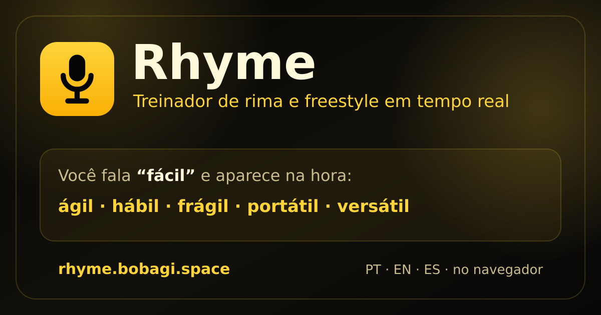

<p align="center">
  
</p>

<h1 align="center">Rhyme</h1>

<p align="center">
  <strong>Treinador de rima e freestyle em tempo real.</strong><br>
  Fale no microfone e veja rimas — perfeitas e toantes — aparecerem na hora.
</p>

<p align="center">
  🔗 <a href="https://rhyme.bobagi.space"><strong>rhyme.bobagi.space</strong></a>
  &nbsp;·&nbsp; Google Chrome (precisa de microfone + HTTPS)
</p>

---

## O que é

Rhyme é um app **100% no navegador** (sem build, sem backend) que usa o
reconhecimento de voz nativo (Web Speech API) pra transcrever o que você fala e
**sugerir rimas em tempo real** — pensado pra treino de freestyle/improviso.
Funciona em **português, inglês e espanhol**.

## Destaques

- 🎙️ **Transcrição ao vivo** — as sugestões atualizam enquanto você fala (interim results).
- 🎯 **Rimas de verdade** — casadas pela vogal tônica (rima perfeita), com fallback
  para rimas **aproximadas e toantes** quando a palavra é difícil (ex.: `fácil` →
  `ágil`, `hábil`, `frágil`, `portátil`), então o painel **nunca fica vazio**.
- 🌎 **PT · EN · ES** — a bandeira troca a transcrição **e** a fonte de rimas.
- ⚡ **Offline-friendly** — listas de frequência cacheadas em `localStorage`.
- 📋 **Clique pra copiar** qualquer sugestão, sem parar o microfone.
- 🪶 **Sem dependências / sem build** — só `index.html` + ES modules.

## Stack

Vanilla JS (ES modules), Web Speech API e AudioContext. Servido como arquivos
estáticos (nginx). Sem framework e sem etapa de build.

## Run locally

From the project root, start a static file server:

```bash
python3 -m http.server 5500
```

Open the app in Google Chrome:

```text
http://localhost:5500
```

Click **Start listening** and allow microphone access.

> Microphone transcription needs a **secure context**. `localhost` counts as secure,
> so local dev works over plain HTTP; any other host must be served over **HTTPS**.

## Run in GitHub Codespaces

From the project root, start a static file server:

```bash
python3 -m http.server 5500
```

Then:

1. Open the **Ports** tab in Codespaces.
2. Find port **5500**.
3. Set visibility to **Public** if needed.
4. Click **Open in Browser**.
5. Open the forwarded **HTTPS** URL in Google Chrome.
6. Allow microphone access.
7. Click **Start listening**.

## Browser support

Use Google Chrome for this MVP.

Brave can capture microphone audio, but it may block or fail Chrome's Web Speech API transcription service and repeatedly return:

```text
Speech recognition error: network
```

To try Brave anyway:

1. Open `brave://settings/privacy`.
2. Disable Shields for the app URL.
3. Enable Brave settings that allow Google services or Google login-related services, if available in your Brave version.
4. Restart Brave and test again.

If Brave still returns `network`, use Google Chrome.

## Speech recognition implementation

The app uses the browser-native Web Speech API:

- `SpeechRecognition` / `webkitSpeechRecognition`
- continuous recognition + interim results
- selectable language: `pt-BR` (default), `en-US`, `es-ES` — choosing a flag in the
  rhyme panel switches both the transcription locale and the rhyme source
- auto-restarts on `end`/recoverable errors (`no-speech`, `network`) with backoff,
  so it keeps listening without spinning a tight loop
- live microphone level meter via `AudioContext`

## Rhyme engine

Rhymes are computed locally in `src/services/rhymeEngine.js`, with no API calls:

- **Tonic-rime matching** — a rhyme is keyed on the stressed (tonic) vowel onward,
  not the last N letters, so `coração` rhymes with `paixão`/`canção` (`-ão`) while
  `vida` (`-ida`) stays apart from `dia` (`-ia`). Stress is detected from graphic
  accents and pt/es default-stress rules; English falls back to a suffix key.
- **Tiered fallback** — perfect rhymes are scarce or nonexistent for a whole class
  of words (proparoxytones and consonant-ending paroxytones like `fácil`/`rápido`).
  When the perfect tier is thin, the engine relaxes to (2) the same tonic vowel
  skeleton **plus** the same ending (tight slant rhyme) and then (3) the tonic vowel
  skeleton alone (assonant / *toante*). Common words keep a clean perfect-only list;
  hard words still get usable suggestions instead of nothing.
- **Words *and* phrases** — phrases rhyme by their last word (e.g. `com todo meu valor`).
- **Frequency-ranked** — candidates come from the `hermitdave/FrequencyWords` 50k
  lists (pt/en/es), already ordered by usage, plus a curated pt catalog.
- **Offline-friendly** — fetched lists are cached in `localStorage`; a curated
  catalog gives instant results before the lists finish loading.
- **Real-time** — suggestions update from the live interim transcript (debounced).

Click any suggestion to copy it. See `docs/frequency-words.md` for data/licensing.
